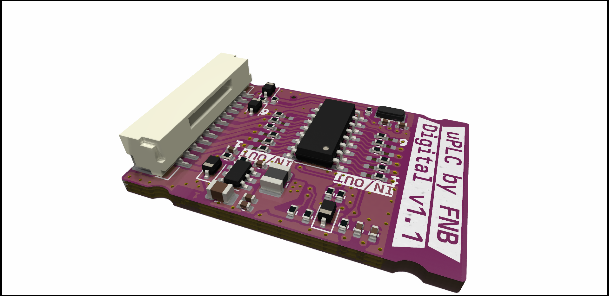
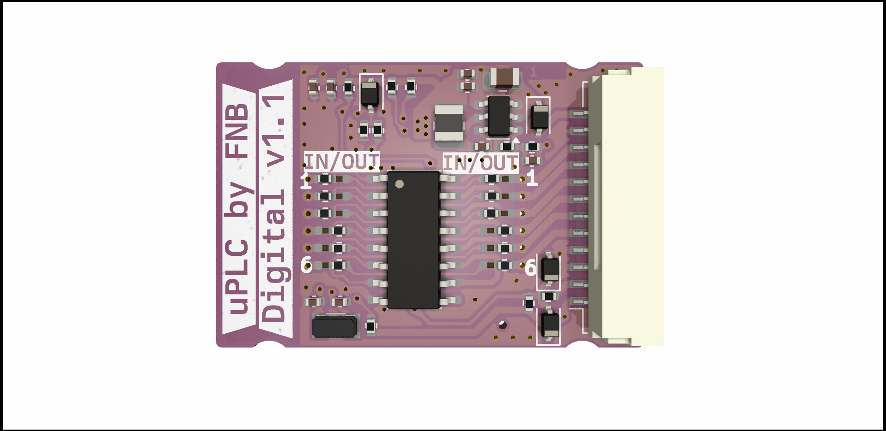
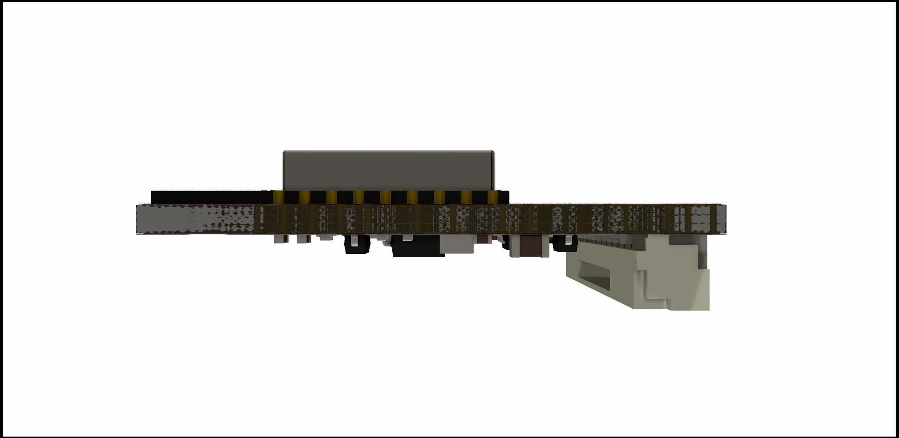
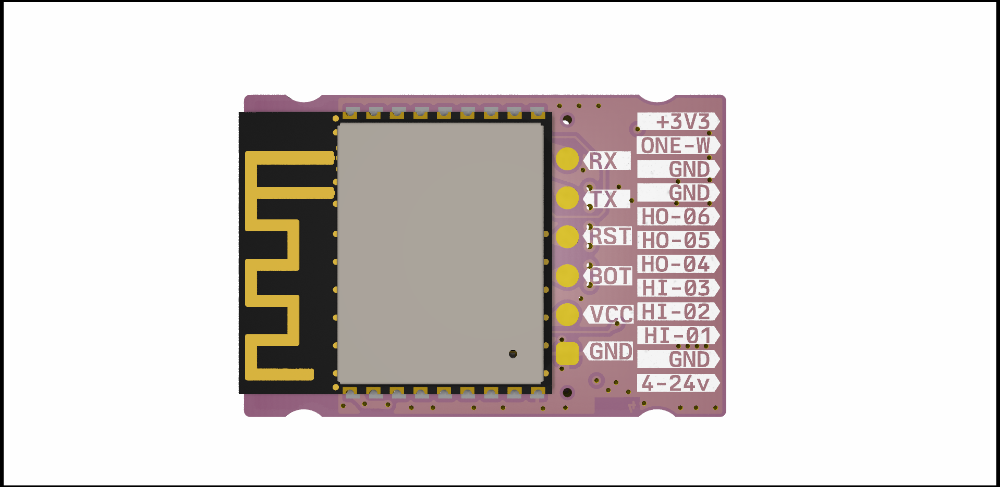

# μPLC - Digital V1.1_WORK IN PROGRESS-UNTESTED_-

ESP micro PLC the size of a post stamp. 

The uPLC-digital version is an [ESP-32-C3](./DOCUMENTATION/esp-12f_product_specification_en.pdf) wifi, bluetooth module for communication and MCU, it has a 3.8-24V buck regulator, has three 2.5-25V inputs, three 2.5-25v, 100ma high speed open drain outputs through a [TBD062003](./DOCUMENTATION/2304140030_TOSHIBA-TBD62003AFWG_C114084.pdf) DMOS transistor array ic. And one protected 3.3v GPIO for onwire communication (Eg for DS18b20 sensors)

[Schematic](./DOCUMENTATION/_schematic.pdf)

[Assembly IBOM](https://htmlpreview.github.io/?https://raw.githubusercontent.com/fredriknk/uplc-digital/main/DOCUMENTATION/ibom.html)

## Specifications
| **Parameter**   | **Description**                                                     |
|-----------------|---------------------------------------------------------------------|
| _Input voltage_ | 3.8-24v                               |
| _Current_       | TBD Wifi: ##mA, Radio Off: ##mA, Deep sleep ##uA |  
| _Communication_ | 2.4ghz WIFI, Uart TTL                            |
| _Baudrate_      | 115200                                                              |
| _PCB size_      | 21x31.4mm                                                             |
| _PCB info_      | 1.6mm FR4, HASL lead free, 4 layer               |
| _Case size_     | XxXxXmm TBD                                                         |

## FIRST PRODUCTION PROTOTYPE
TODO

## Connector

| **Label**   | **GPIO**|**Description**       |
|------------|-----|-------------------------|
|_3V3_ | 3V3 | 3.3v output for sensor connection |
|_ONE-W_ | GPIO18  | Protected gpio for onewire comm |
|_GND_ | GND | GND port for sensor connection|
|_GND_ | GND | GND port for sensor connection |
|_HO-06_ | GPIO10  | 25v 100ma open drain output |
|_HO-05_ | GPIO19  | 25v 100ma open drain output |
|_HO-04_ | GPIO3  | 25v 100ma open drain output |
|_HI-03_ | GPIO7  | 2.5-25v input (with pulldown) |
|_HI-02_ | GPIO6  | 2.5-25v input (with pulldown) |
|_HI-01_ | GPIO5  | 2.5-25v input (with pulldown) |
|_GND_ | GND |  Ground  |
|_4-24V_ | Buck reg |3.8-24v polarity protected input |

## PCB Pictures

## Homeassistant Implementation
TODO
